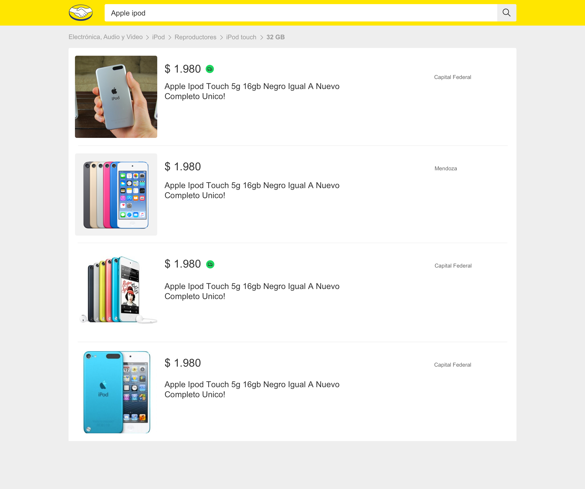

# MercadoLibre Products API

> Product search bar using the MELI API with NodeJS and React



Open the web page, search for a product to get some details and the price.

## Built With

- [NodeJS](https://nodejs.org/en/)
- [React](https://reactjs.org/)
- [Express](https://expressjs.com/)
- [pnpm](https://pnpm.js.org/)
- [Vite](https://vitejs.dev/)

## Live Demo

[Live Demo Link](https://livedemo.com)

## Getting Started

To get a local copy up and running follow these simple example steps.

### Prerequisites

Install [NodeJS](https://nodejs.org/en/) downloading the installer from the official website. Optionally, you can use [volta](https://volta.sh/) to manage the NodeJS version.

```bash
curl https://get.volta.sh | bash
```

Install [pnpm](https://pnpm.js.org/)

```bash
npm install -g pnpm
```

Clone or download the repository

```bash
git clone git@github.com:jorgevrgs/meli-react.git
cd meli-react
```

### Setup

Create a `.env.local` file in the root of the project and add the following variables:

```env
SITE_ID=MCO
DEFAULT_PAGINATION_LIMIT=4
AUTHOR_FIRST_NAME=Jorge
AUTHOR_LAST_NAME=Vargas
```

Find the `SITE_ID` in the [MELI API sites](https://api.mercadolibre.com/sites) and copy one of the `id` values. To simplify the search, the `DEFAULT_PAGINATION_LIMIT` is set to 4, but you can change it to any number you want.

To create a copy of the `.env.example` file you can run the following command instead of creating the file manually:

```bash
cp .env.example .env.local
```

### Install

Install dependencies

```bash
pnpm install
```

### Usage

Start the server

```bash
pnpm dev
```

Open [http://localhost:5173](http://localhost:5173) with your browser to see the result.

### Run tests

```bash
pnpm test
```

### Deployment

## Authors

👤 Jorge Vargas

- GitHub: [@jorgevrgs](https://github.com/jorgevrgs)
- Twitter: [@jorgevrgs1](https://twitter.com/jorgevrgs1)
- LinkedIn: [LinkedIn](https://linkedin.com/in/jevargaslarrota)

## 🤝 Contributing

Contributions, issues, and feature requests are welcome!

Feel free to check the [issues page](../../issues/).

## Show your support

Give a ⭐️ if you like this project!

## Acknowledgments

- Hat tip to anyone whose code was used
- Inspiration
- etc

## 📝 License

This project is [MIT](./MIT.md) licensed.
